# Backend Architecture — Autonomous Brand Operating System

> **Version:** 1.0  
> **Date:** March 15, 2026  
> **Status:** Production Architecture Specification  
> **Authors:** Backend Architecture Team

---

## Table of Contents

1. [System Overview](#1-system-overview)
2. [High-Level Backend Architecture](#2-high-level-backend-architecture)
3. [NestJS Architecture](#3-nestjs-architecture)
4. [Agent Orchestration System](#4-agent-orchestration-system)
5. [Data Architecture](#5-data-architecture)
6. [Queue Architecture](#6-queue-architecture)
7. [SEO Pipeline](#7-seo-pipeline)
8. [SCO Pipeline](#8-sco-pipeline)
9. [RAG Architecture](#9-rag-architecture)
10. [API Design](#10-api-design)
11. [Security](#11-security)
12. [Observability](#12-observability)
13. [Scaling Strategy](#13-scaling-strategy)
14. [Infrastructure](#14-infrastructure)
15. [Phase Implementation Strategy](#15-phase-implementation-strategy)

---

## Tech Stack Summary

| Layer | Technology |
|---|---|
| Backend Framework | NestJS (TypeScript) |
| Primary Database | MongoDB |
| Cache & Pub/Sub | Redis |
| Queue | BullMQ (Redis-backed) |
| Vector Database | MongoDB Atlas Vector Search |
| AI Provider | Google Gemini |
| AI Orchestration | LangChain |
| Containerization | Docker |
| Orchestration | Kubernetes (EKS) |
| Cloud | AWS |
| Object Storage | AWS S3 |
| CDN | Amazon CloudFront |
| Authentication | Better Auth |
| Observability | Grafana + Prometheus + Loki |
| Frontend (future) | Next.js |

---

## 1. System Overview

The **Autonomous Brand Operating System** is an AI-powered SaaS platform that automates end-to-end marketing operations for brands. The backend serves as the intelligence layer — orchestrating AI agents, managing data pipelines, and exposing APIs consumed by a Next.js frontend.

### Core Capabilities

- **SEO Optimization** — Automated keyword research, competitor scraping, content analysis, and SEO scoring
- **Search Context Optimization (SCO)** — AI answer tracking, prompt experimentation, visibility scoring across LLM-powered search engines (ChatGPT, Gemini, Perplexity)
- **AI Content Generation** — On-brand content creation for blogs, ads, social posts, and email campaigns powered by Google Gemini via LangChain
- **Publishing Automation** — Multi-channel content distribution through platform APIs
- **Analytics** — Unified performance metrics across SEO, SCO, and paid channels
- **Brand Intelligence** — Real-time competitive analysis, brand profiling, and market signal tracking

### Design Principles

| Principle | Implementation |
|---|---|
| Modularity | Each domain is a standalone NestJS module with clear boundaries |
| Event-Driven | BullMQ queues decouple long-running AI/scraping tasks from request cycles |
| Agent-Native | LangChain agents orchestrate multi-step workflows autonomously |
| Phase-Gated | Architecture is additive — Phase 1 ships lean, Phase 2/3 extend without rewrites |
| API-First | REST endpoints designed for Next.js consumption with consistent contracts |
| Cloud-Native | Docker + Kubernetes on AWS for horizontal scaling |

---

## 2. High-Level Backend Architecture

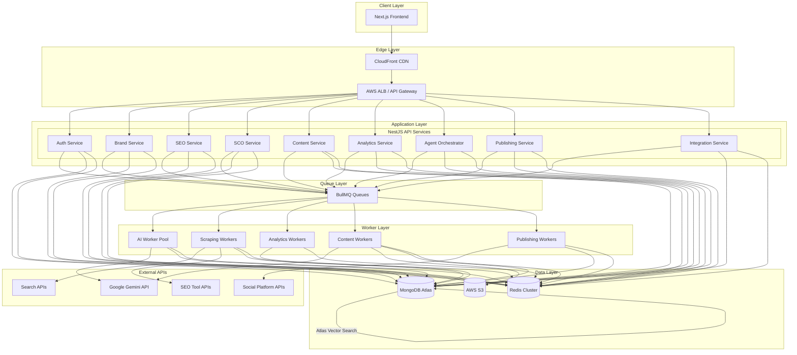

### Data Flow Summary

1. **Request Path** — Next.js → CloudFront → ALB → NestJS API → MongoDB/Redis → Response
2. **Async Task Path** — NestJS API → BullMQ Queue → Worker → External API → Write results to MongoDB → Notify via Redis Pub/Sub
3. **AI Agent Path** — Agent Orchestrator → BullMQ → AI Worker → LangChain → Google Gemini → Store outputs → Trigger next agent step
4. **Vector Path** — Content/Documents → Embedding via Gemini → MongoDB Atlas Vector Search → Retrieved during RAG queries

---

## 3. NestJS Architecture

### Module Design

The NestJS application follows a **domain-driven modular** architecture. Each module encapsulates its own controllers, services, repositories, DTOs, and queue processors.

| Module | Responsibility | Phase |
|---|---|---|
| `AuthModule` | Authentication (Better Auth), session management, RBAC | 1 |
| `BrandModule` | Brand profiles, knowledge base, brand settings | 1 |
| `SEOModule` | Keyword research, competitor analysis, SEO scoring | 1 |
| `ContentModule` | AI content generation, asset management, templates | 1 |
| `AnalyticsModule` | Metrics collection, dashboards, event tracking | 1 |
| `AgentOrchestratorModule` | Agent workflow execution, task scheduling, state management | 1 |
| `SCOModule` | Prompt tracking, AI answer scraping, visibility scoring | 2 |
| `PublishingModule` | Multi-channel publishing, scheduling, status tracking | 3 |
| `IntegrationModule` | Third-party connectors (social, CRM, e-commerce) | 3 |
| `RAGModule` | Document ingestion, embedding, vector retrieval | 2 |
| `SharedModule` | Common utilities, guards, interceptors, pipes | 1 |

### Folder Structure

```
src/
├── main.ts
├── app.module.ts
├── config/
│   ├── app.config.ts
│   ├── database.config.ts
│   ├── redis.config.ts
│   ├── queue.config.ts
│   ├── auth.config.ts
│   └── ai.config.ts
│
├── shared/
│   ├── shared.module.ts
│   ├── guards/
│   │   ├── auth.guard.ts
│   │   ├── roles.guard.ts
│   │   └── rate-limit.guard.ts
│   ├── interceptors/
│   │   ├── logging.interceptor.ts
│   │   ├── transform.interceptor.ts
│   │   └── timeout.interceptor.ts
│   ├── pipes/
│   │   └── validation.pipe.ts
│   ├── filters/
│   │   └── http-exception.filter.ts
│   ├── decorators/
│   │   ├── current-user.decorator.ts
│   │   └── roles.decorator.ts
│   ├── dto/
│   │   └── pagination.dto.ts
│   └── utils/
│       ├── crypto.util.ts
│       └── slug.util.ts
│
├── auth/
│   ├── auth.module.ts
│   ├── auth.controller.ts
│   ├── auth.service.ts
│   ├── better-auth.config.ts
│   ├── strategies/
│   │   └── jwt.strategy.ts
│   ├── dto/
│   │   ├── login.dto.ts
│   │   ├── register.dto.ts
│   │   └── refresh-token.dto.ts
│   └── schemas/
│       ├── user.schema.ts
│       └── session.schema.ts
│
├── brand/
│   ├── brand.module.ts
│   ├── brand.controller.ts
│   ├── brand.service.ts
│   ├── brand.repository.ts
│   ├── dto/
│   │   ├── create-brand.dto.ts
│   │   └── update-brand.dto.ts
│   └── schemas/
│       └── brand.schema.ts
│
├── seo/
│   ├── seo.module.ts
│   ├── seo.controller.ts
│   ├── seo.service.ts
│   ├── services/
│   │   ├── keyword-research.service.ts
│   │   ├── competitor-analysis.service.ts
│   │   └── seo-scoring.service.ts
│   ├── processors/
│   │   ├── keyword-research.processor.ts
│   │   └── competitor-scraping.processor.ts
│   ├── dto/
│   │   ├── keyword-research.dto.ts
│   │   └── competitor-analysis.dto.ts
│   └── schemas/
│       ├── seo-keyword.schema.ts
│       └── competitor.schema.ts
│
├── sco/
│   ├── sco.module.ts
│   ├── sco.controller.ts
│   ├── sco.service.ts
│   ├── services/
│   │   ├── prompt-tracking.service.ts
│   │   ├── ai-answer-scraper.service.ts
│   │   └── visibility-scoring.service.ts
│   ├── processors/
│   │   ├── prompt-query.processor.ts
│   │   └── answer-analysis.processor.ts
│   ├── dto/
│   │   ├── create-prompt.dto.ts
│   │   └── visibility-report.dto.ts
│   └── schemas/
│       ├── ai-prompt-log.schema.ts
│       └── ai-answer.schema.ts
│
├── content/
│   ├── content.module.ts
│   ├── content.controller.ts
│   ├── content.service.ts
│   ├── services/
│   │   ├── content-generator.service.ts
│   │   └── template.service.ts
│   ├── processors/
│   │   └── content-generation.processor.ts
│   ├── dto/
│   │   ├── generate-content.dto.ts
│   │   └── content-asset.dto.ts
│   └── schemas/
│       └── content-asset.schema.ts
│
├── analytics/
│   ├── analytics.module.ts
│   ├── analytics.controller.ts
│   ├── analytics.service.ts
│   ├── services/
│   │   ├── event-tracker.service.ts
│   │   └── report-builder.service.ts
│   ├── processors/
│   │   └── analytics-pipeline.processor.ts
│   ├── dto/
│   │   ├── track-event.dto.ts
│   │   └── analytics-query.dto.ts
│   └── schemas/
│       └── analytics-event.schema.ts
│
├── agent-orchestrator/
│   ├── agent-orchestrator.module.ts
│   ├── agent-orchestrator.controller.ts
│   ├── agent-orchestrator.service.ts
│   ├── agents/
│   │   ├── base.agent.ts
│   │   ├── brand-profiler.agent.ts
│   │   ├── competitor-analysis.agent.ts
│   │   ├── seo.agent.ts
│   │   ├── content.agent.ts
│   │   ├── analytics.agent.ts
│   │   ├── sco.agent.ts                    # Phase 2
│   │   ├── prompt-tracking.agent.ts         # Phase 2
│   │   ├── publishing.agent.ts              # Phase 3
│   │   ├── brand-compliance.agent.ts        # Phase 3
│   │   ├── forecasting.agent.ts             # Phase 3
│   │   └── reinforcement-learning.agent.ts  # Phase 3
│   ├── workflows/
│   │   ├── seo-analysis.workflow.ts
│   │   ├── content-generation.workflow.ts
│   │   ├── sco-tracking.workflow.ts         # Phase 2
│   │   └── full-campaign.workflow.ts        # Phase 3
│   ├── services/
│   │   ├── agent-state.service.ts
│   │   ├── agent-memory.service.ts
│   │   └── workflow-engine.service.ts
│   ├── processors/
│   │   └── agent-task.processor.ts
│   └── schemas/
│       ├── agent-task.schema.ts
│       └── agent-state.schema.ts
│
├── publishing/                               # Phase 3
│   ├── publishing.module.ts
│   ├── publishing.controller.ts
│   ├── publishing.service.ts
│   ├── connectors/
│   │   ├── facebook.connector.ts
│   │   ├── instagram.connector.ts
│   │   ├── linkedin.connector.ts
│   │   └── google-ads.connector.ts
│   ├── dto/
│   │   └── publish-content.dto.ts
│   └── schemas/
│       └── publication.schema.ts
│
├── integration/                              # Phase 3
│   ├── integration.module.ts
│   ├── integration.controller.ts
│   ├── integration.service.ts
│   ├── connectors/
│   │   ├── shopify.connector.ts
│   │   ├── google-search-console.connector.ts
│   │   └── google-analytics.connector.ts
│   └── schemas/
│       └── integration-config.schema.ts
│
├── rag/                                      # Phase 2
│   ├── rag.module.ts
│   ├── rag.service.ts
│   ├── services/
│   │   ├── document-ingestion.service.ts
│   │   ├── embedding.service.ts
│   │   └── vector-search.service.ts
│   ├── processors/
│   │   └── ingestion.processor.ts
│   └── schemas/
│       └── document-chunk.schema.ts
│
└── common/
    ├── constants/
    │   ├── queues.constant.ts
    │   └── roles.constant.ts
    ├── enums/
    │   ├── agent-status.enum.ts
    │   └── content-type.enum.ts
    └── interfaces/
        ├── paginated-response.interface.ts
        └── agent-config.interface.ts
```

### Module Dependency Graph

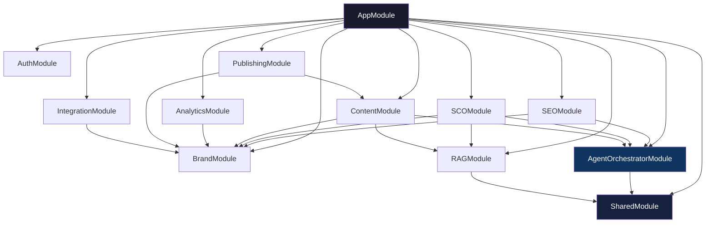

---

## 4. Agent Orchestration System

The Agent Orchestration System is the brain of the platform. It manages multi-step AI workflows using LangChain agents backed by Google Gemini, with BullMQ handling task distribution.

### Architecture Overview

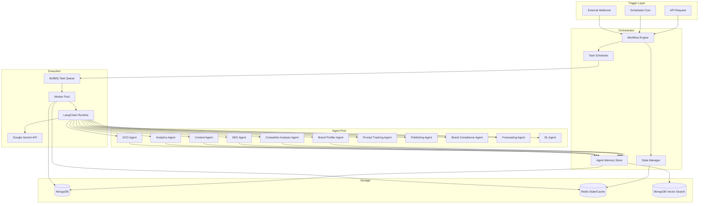

### Agent Definitions

| Agent | Purpose | Tools Used | Phase |
|---|---|---|---|
| Brand Profiler Agent | Ingests website/social data, builds brand knowledge graph | Web scraper, NLP extractor | 1 |
| Competitor Analysis Agent | Scrapes competitor sites, extracts strategy signals | Web scraper, SERP API | 1 |
| SEO Agent | Keyword research, on-page analysis, SEO scoring | Keyword APIs, content analyzer | 1 |
| Content Agent | Generates on-brand content (blogs, ads, social) | Gemini, brand memory, templates | 1 |
| Analytics Agent | Aggregates metrics, builds performance reports | Analytics APIs, report builder | 1 |
| SCO Agent | Queries LLMs, tracks AI answer visibility | Gemini API, answer parser | 2 |
| Prompt Tracking Agent | Manages prompt experiments, tracks mention rates | Prompt DB, A/B engine | 2 |
| Publishing Agent | Distributes content to channels | Social APIs, CMS connectors | 3 |
| Brand Compliance Agent | Validates content against brand rules | Brand guideline DB, image analyzer | 3 |
| Forecasting Agent | Predicts campaign performance using AI signals | Time-series models, sales data | 3 |
| RL Agent | Optimizes content/prompts via reinforcement learning | Contextual bandit, reward tracker | 3 |

### Task Scheduling

```typescript
// Agent tasks are scheduled via BullMQ with configurable strategies
interface AgentTask {
  taskId: string;
  agentType: AgentType;
  workflowId: string;
  brandId: string;
  input: Record<string, any>;
  priority: 'critical' | 'high' | 'normal' | 'low';
  retryPolicy: {
    maxRetries: number;
    backoffType: 'exponential' | 'fixed';
    backoffDelay: number;
  };
  timeout: number;
  dependsOn?: string[];  // task IDs that must complete first
}
```

**Scheduling strategies:**

- **Immediate** — User-triggered tasks (e.g., generate content now)
- **Cron-based** — Recurring tasks (e.g., daily competitor scraping at 2 AM UTC)
- **Event-driven** — Triggered by completion of upstream tasks (e.g., SEO analysis triggers content generation)
- **Priority queues** — Critical tasks (auth, compliance) preempt normal workloads

### Queue Orchestration

Tasks flow through named BullMQ queues per domain:

```
agent:brand-profiler      → Brand ingestion tasks
agent:competitor-analysis → Competitor scraping/analysis
agent:seo                 → Keyword research, SEO scoring
agent:content             → Content generation via Gemini
agent:analytics           → Metrics aggregation pipelines
agent:sco                 → AI prompt querying (Phase 2)
agent:publishing          → Channel distribution (Phase 3)
```

Each queue has dedicated worker concurrency settings. AI-heavy queues (`agent:content`, `agent:sco`) are rate-limited to respect Gemini API quotas.

### Agent Memory

Each agent maintains contextual memory powered by MongoDB + MongoDB Atlas Vector Search:

- **Short-term memory** — Current task context stored in Redis (TTL: task duration). Includes intermediate results, chain-of-thought steps, and tool call outputs.
- **Long-term memory** — Persisted in MongoDB. Includes past task results, learned patterns, and brand-specific knowledge.
- **Semantic memory** — Brand knowledge, content corpus, and competitor data stored as vector embeddings in MongoDB Atlas Vector Search. Retrieved via similarity search during agent execution.

```typescript
interface AgentMemory {
  agentId: string;
  brandId: string;
  shortTerm: {
    key: string;        // Redis key
    ttl: number;        // seconds
  };
  longTerm: {
    collectionName: string;  // MongoDB collection
    maxEntries: number;
  };
  semantic: {
    indexName: string;       // MongoDB Atlas vector index
    embeddingModel: string;  // Gemini embedding model
    topK: number;
  };
}
```

### Agent State Machine

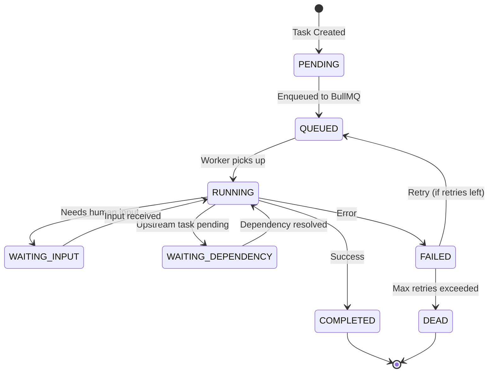

---

## 5. Data Architecture

### MongoDB Collections

All collections are stored in MongoDB Atlas with proper indexing and schema validation.

#### `brands`

```typescript
{
  _id: ObjectId,
  name: string,
  slug: string,
  ownerId: ObjectId,               // ref: users
  website: string,
  industry: string,
  description: string,
  guidelines: {
    tone: string[],                 // ["professional", "friendly"]
    colors: string[],               // ["#1a73e8", "#ffffff"]
    fonts: string[],
    logoUrl: string,                // S3 URL
    doNotUse: string[],
  },
  competitors: [{
    name: string,
    website: string,
    notes: string,
  }],
  knowledgeBase: {
    lastIngested: Date,
    documentCount: number,
    vectorIndexName: string,
  },
  subscription: {
    plan: 'starter' | 'growth' | 'enterprise',
    status: 'active' | 'canceled' | 'past_due',
    expiresAt: Date,
  },
  createdAt: Date,
  updatedAt: Date,
}
// Indexes: { slug: 1 } unique, { ownerId: 1 }, { industry: 1 }
```

#### `campaigns`

```typescript
{
  _id: ObjectId,
  brandId: ObjectId,                // ref: brands
  name: string,
  type: 'seo' | 'sco' | 'content' | 'ads' | 'social' | 'email',
  status: 'draft' | 'active' | 'paused' | 'completed',
  goals: {
    targetKeywords: string[],
    targetAudience: string,
    kpis: Record<string, number>,   // { "organic_traffic": 10000 }
  },
  schedule: {
    startDate: Date,
    endDate: Date,
    timezone: string,
  },
  agentWorkflowId: string,
  results: {
    metrics: Record<string, number>,
    lastUpdated: Date,
  },
  createdAt: Date,
  updatedAt: Date,
}
// Indexes: { brandId: 1, status: 1 }, { type: 1 }, { "schedule.startDate": 1 }
```

#### `seo_keywords`

```typescript
{
  _id: ObjectId,
  brandId: ObjectId,
  keyword: string,
  searchVolume: number,
  difficulty: number,               // 0-100
  cpc: number,
  currentRank: number | null,
  previousRank: number | null,
  intent: 'informational' | 'navigational' | 'transactional' | 'commercial',
  serp: {
    featuredSnippet: boolean,
    aiOverview: boolean,
    topCompetitors: string[],
  },
  trend: 'rising' | 'stable' | 'declining',
  tags: string[],
  source: string,                   // "semrush", "manual", "agent"
  lastUpdated: Date,
  createdAt: Date,
}
// Indexes: { brandId: 1, keyword: 1 } unique, { searchVolume: -1 }, { difficulty: 1 }
```

#### `ai_prompt_logs`

```typescript
{
  _id: ObjectId,
  brandId: ObjectId,
  prompt: string,
  engine: 'gemini' | 'chatgpt' | 'perplexity' | 'google_ai_overview',
  response: string,
  brandMentioned: boolean,
  mentionPosition: number | null,    // position in answer (1 = first)
  competitorsMentioned: string[],
  sentiment: 'positive' | 'neutral' | 'negative',
  contextRelevance: number,          // 0.0 - 1.0
  tokens: {
    input: number,
    output: number,
  },
  experimentId: string | null,       // A/B test grouping
  createdAt: Date,
}
// Indexes: { brandId: 1, engine: 1 }, { experimentId: 1 }, { createdAt: -1 }
```

#### `ai_answers`

```typescript
{
  _id: ObjectId,
  promptLogId: ObjectId,            // ref: ai_prompt_logs
  brandId: ObjectId,
  query: string,
  answer: string,
  engine: string,
  embedding: number[],              // Vector embedding for similarity search
  entities: [{
    name: string,
    type: string,
    sentiment: string,
  }],
  sources: [{
    url: string,
    title: string,
    cited: boolean,
  }],
  visibilityScore: number,          // 0.0 - 1.0
  answerShare: number,              // brand mention % across all answers
  scrapedAt: Date,
  createdAt: Date,
}
// Indexes: { brandId: 1, engine: 1 }, { scrapedAt: -1 }
// Vector Index: { embedding: "vectorSearch" } using MongoDB Atlas Vector Search
```

#### `content_assets`

```typescript
{
  _id: ObjectId,
  brandId: ObjectId,
  campaignId: ObjectId | null,
  type: 'blog' | 'ad_copy' | 'social_post' | 'email' | 'landing_page' | 'video_script',
  title: string,
  body: string,
  metadata: {
    keywords: string[],
    targetAudience: string,
    tone: string,
    wordCount: number,
    readingLevel: string,
  },
  seoScore: number | null,          // 0-100
  complianceStatus: 'pending' | 'passed' | 'failed',
  complianceNotes: string[],
  status: 'draft' | 'approved' | 'published' | 'archived',
  publishedTo: [{
    platform: string,
    publishedAt: Date,
    externalId: string,
    url: string,
  }],
  s3Key: string | null,             // S3 reference for media assets
  embedding: number[],              // Content embedding for RAG
  generatedBy: {
    agentId: string,
    model: string,
    promptVersion: string,
  },
  createdAt: Date,
  updatedAt: Date,
}
// Indexes: { brandId: 1, type: 1 }, { status: 1 }, { campaignId: 1 }
// Vector Index: { embedding: "vectorSearch" }
```

#### `analytics_events`

```typescript
{
  _id: ObjectId,
  brandId: ObjectId,
  campaignId: ObjectId | null,
  eventType: 'impression' | 'click' | 'conversion' | 'engagement' | 'ai_mention' | 'rank_change',
  source: 'google_organic' | 'social' | 'ads' | 'ai_search' | 'direct' | 'email',
  channel: string,                  // "google", "facebook", "chatgpt", etc.
  metric: string,                   // "page_views", "ctr", "ai_visibility_score"
  value: number,
  dimensions: Record<string, string>, // { country: "US", device: "mobile" }
  contentAssetId: ObjectId | null,
  timestamp: Date,
  createdAt: Date,
}
// Indexes: { brandId: 1, eventType: 1, timestamp: -1 }, { source: 1 }
// TTL Index: { createdAt: 1 }, expireAfterSeconds: 31536000  (1 year for raw events)
```

### Redis Caching Strategy

| Cache Type | Key Pattern | TTL | Purpose |
|---|---|---|---|
| API Response | `cache:api:{route}:{hash}` | 5 min | Cache frequent API reads |
| Brand Profile | `cache:brand:{brandId}` | 15 min | Hot brand data for agents |
| SEO Keywords | `cache:seo:keywords:{brandId}` | 1 hour | Keyword lists |
| Agent State | `agent:state:{taskId}` | Duration of task | Active task state |
| Rate Limit | `ratelimit:{userId}:{endpoint}` | 1 min | Per-user rate limiting |
| Session | `session:{sessionId}` | 24 hours | Better Auth sessions |
| Leaderboard | `analytics:top:{brandId}:{metric}` | 30 min | Top-performing content |

**Redis is also used for:**
- BullMQ queue backend (job storage, delayed jobs, priority queues)
- Pub/Sub for real-time notifications to the Next.js frontend via SSE/WebSocket
- Distributed locks for preventing duplicate agent executions

### MongoDB Atlas Vector Search

Instead of a separate vector DB, we use **MongoDB Atlas Vector Search** to store and query embeddings natively alongside our operational data. This eliminates data synchronization overhead and reduces infrastructure complexity.

**Vector Indexes:**

| Collection | Field | Dimensions | Similarity | Purpose |
|---|---|---|---|---|
| `ai_answers` | `embedding` | 768 | cosine | SCO answer similarity search |
| `content_assets` | `embedding` | 768 | cosine | RAG content retrieval |
| `document_chunks` | `embedding` | 768 | cosine | Brand knowledge base retrieval |

**Vector Search Query Example:**

```typescript
// MongoDB Atlas Vector Search aggregation
const results = await db.collection('document_chunks').aggregate([
  {
    $vectorSearch: {
      index: 'brand_knowledge_index',
      path: 'embedding',
      queryVector: queryEmbedding,  // Generated via Gemini embedding
      numCandidates: 100,
      limit: 10,
      filter: { brandId: targetBrandId },
    },
  },
  {
    $project: {
      content: 1,
      source: 1,
      score: { $meta: 'vectorSearchScore' },
    },
  },
]);
```

---

## 6. Queue Architecture

### BullMQ Queue Design

All async operations run through BullMQ backed by Redis. Queues are organized by domain with isolated concurrency and retry settings.

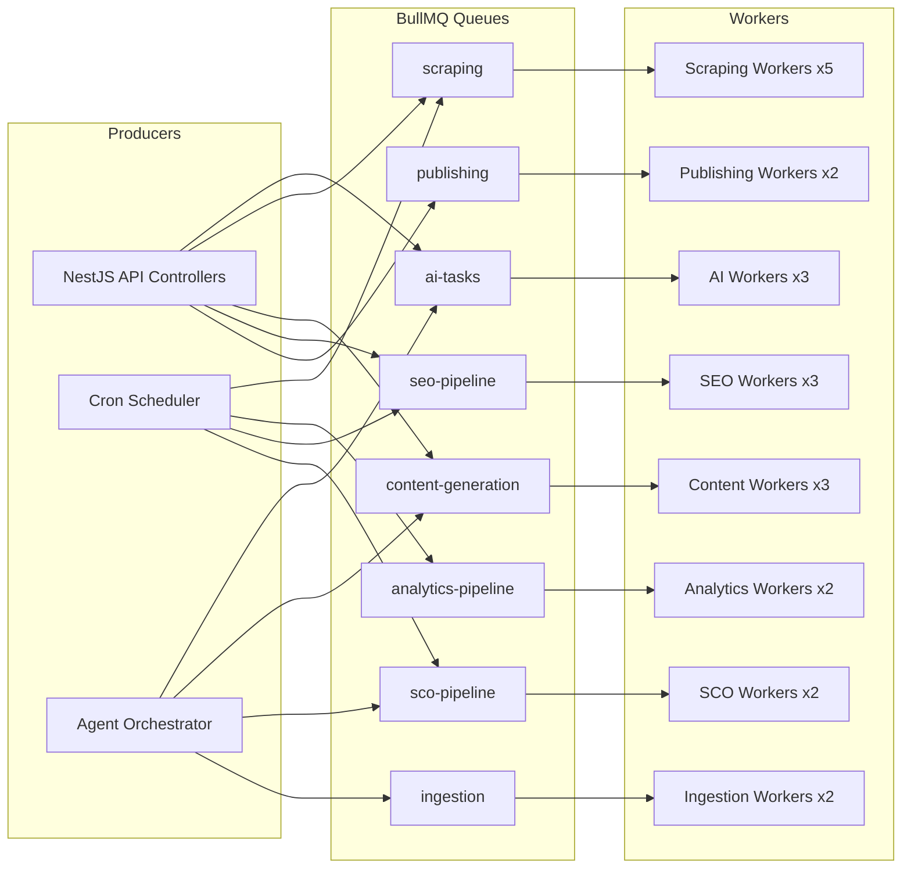

### Queue Configuration

| Queue | Concurrency | Max Retries | Backoff | Rate Limit | Purpose |
|---|---|---|---|---|---|
| `ai-tasks` | 3 | 3 | Exponential 5s | 60/min | Gemini API calls |
| `scraping` | 5 | 5 | Exponential 10s | 30/min | Web scraping tasks |
| `content-generation` | 3 | 2 | Exponential 10s | 30/min | Content creation via Gemini |
| `analytics-pipeline` | 2 | 3 | Fixed 30s | None | Metrics aggregation |
| `seo-pipeline` | 3 | 3 | Exponential 5s | 20/min | SEO analysis workflows |
| `sco-pipeline` | 2 | 3 | Exponential 10s | 20/min | SCO prompt execution |
| `publishing` | 2 | 5 | Exponential 15s | 10/min | Social/CMS publishing |
| `ingestion` | 2 | 3 | Exponential 5s | None | Document/vector ingestion |

### Job Lifecycle

```typescript
// Example: Enqueue a content generation job
await this.contentQueue.add(
  'generate-blog-post',
  {
    brandId: brand._id,
    campaignId: campaign._id,
    brief: {
      topic: 'Best practices for AI-driven SEO',
      keywords: ['ai seo', 'search optimization'],
      tone: 'professional',
      wordCount: 1500,
    },
  },
  {
    priority: 2,
    attempts: 2,
    backoff: { type: 'exponential', delay: 10000 },
    timeout: 120000,        // 2 min max
    removeOnComplete: { age: 86400 },  // keep for 24h
    removeOnFail: { age: 604800 },     // keep failures for 7 days
  },
);
```

### Dead Letter Queue (DLQ)

Failed jobs that exhaust retries are moved to a DLQ for manual inspection:

```
dlq:ai-tasks
dlq:scraping
dlq:content-generation
```

A Grafana dashboard monitors DLQ depth. Alerts fire when DLQ size exceeds thresholds.

---

## 7. SEO Pipeline

### Workflow

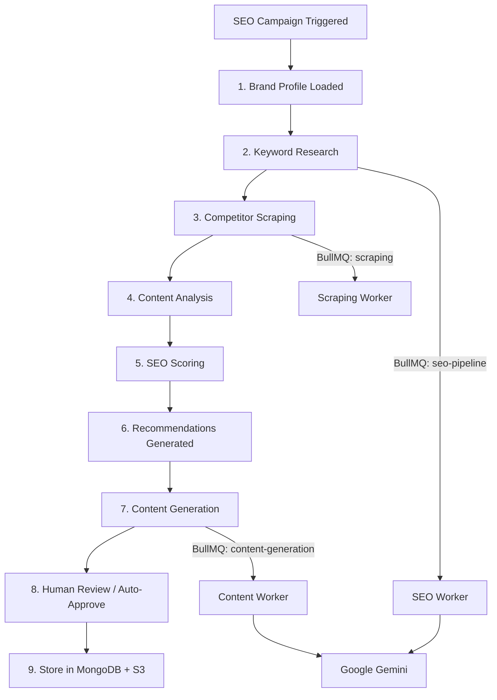

### Pipeline Steps

**Step 1 — Brand Profile Loading**  
The SEO Agent loads the brand's knowledge base from MongoDB (guidelines, competitors, existing keywords) and hydrates agent memory.

**Step 2 — Keyword Research**  
The SEO Agent uses LangChain tools to:
- Query keyword research APIs (SEMrush, Google Keyword Planner)
- Generate seed keywords using Gemini based on brand context
- Classify keyword intent (informational, transactional, commercial, navigational)
- Score opportunity = (searchVolume × (100 - difficulty)) / 100

**Step 3 — Competitor Scraping**  
A scraping job is enqueued for each competitor:
- Extract page titles, meta descriptions, heading structure
- Identify target keywords from on-page content
- Capture backlink profiles via SEO tool APIs
- Results stored in `competitors` subdocuments

**Step 4 — Content Analysis**  
Existing brand content is analyzed against target keywords:
- Content gap identification (keywords with no matching content)
- Cannibalization detection (multiple pages targeting the same keyword)
- Thin content flagging (low word count, poor keyword coverage)

**Step 5 — SEO Scoring**  
Each page/content asset receives an SEO score (0-100) based on:

| Factor | Weight |
|---|---|
| Keyword presence in title, H1, body | 25% |
| Content length and depth | 20% |
| Internal linking | 15% |
| Meta description quality | 10% |
| Schema markup presence | 10% |
| Page speed (via API) | 10% |
| Mobile friendliness | 10% |

**Step 6 — Recommendations**  
The SEO Agent generates actionable recommendations via Gemini:
- New content topics to create
- Existing content to optimize
- Technical SEO fixes
- Link building opportunities

**Step 7 — Content Generation**  
For approved recommendations, the Content Agent generates SEO-optimized content:
- Blog posts with keyword integration
- Meta descriptions and title tags
- FAQ sections targeting featured snippets
- Schema markup suggestions

---

## 8. SCO Pipeline

### Workflow

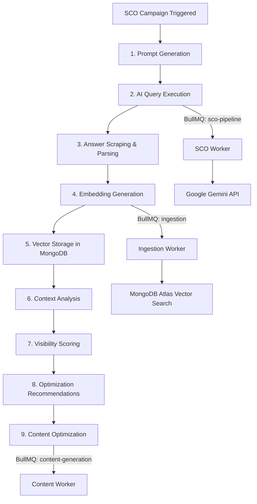

### Pipeline Steps

**Step 1 — Prompt Generation**  
The SCO Agent generates brand-relevant prompts that simulate real user queries:
- `"What is the best {product_category} tool?"`
- `"Compare {brand} vs {competitor}"`
- `"Top recommendations for {use_case}"`

Prompts are varied systematically for A/B testing with `experimentId` tracking.

**Step 2 — AI Query Execution**  
Prompts are sent to multiple AI engines via rate-limited BullMQ jobs:
- Google Gemini API (primary)
- ChatGPT API (via OpenAI)
- Google AI Overviews (via SERP scraping)
- Perplexity (via API or scraping)

**Step 3 — Answer Scraping & Parsing**  
Raw AI responses are parsed to extract:
- Brand mentions (exact match + fuzzy match)
- Mention position in the answer
- Competitor mentions
- Source citations
- Sentiment toward the brand

**Step 4 — Embedding Generation**  
Each answer is embedded using Gemini's `text-embedding-004` model (768 dimensions) and stored in the `ai_answers` collection with the vector field.

**Step 5 — Vector Storage**  
Embeddings are indexed in MongoDB Atlas Vector Search for:
- Answer similarity clustering
- Trend detection across time
- Semantic search during RAG queries

**Step 6 — Context Analysis**  
The SCO Agent analyzes patterns:
- Which query types consistently mention the brand
- Which competitors dominate specific query categories
- How answer content changes over time
- What sources LLMs cite most frequently

**Step 7 — Visibility Scoring**  
Metrics computed per brand per time window:

| Metric | Calculation |
|---|---|
| AI Visibility Score | (branded_mentions / total_queries) × position_weight |
| Answer Share | brand_mentions / (brand + competitor mentions) |
| Context Relevance | cosine_similarity(brand_content_embedding, top_answer_embedding) |
| Sentiment Score | weighted average of mention sentiments |
| Citation Rate | % of answers that cite brand's URLs |

**Step 8 — Optimization Recommendations**  
Based on visibility gaps, the SCO Agent generates:
- Content topics that would improve AI answer inclusion
- FAQ structures that match common AI query patterns
- Schema markup improvements for knowledge graph inclusion
- Prompt-optimized content rewrites

---

## 9. RAG Architecture

The RAG (Retrieval-Augmented Generation) system powers brand-aware content generation by grounding Gemini responses in the brand's actual knowledge base.

### Knowledge Ingestion Pipeline

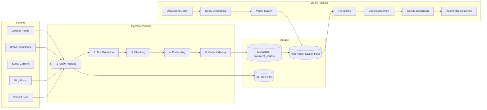

### Chunking Strategy

Documents are split using a hierarchical chunking approach:

| Parameter | Value |
|---|---|
| Chunk size | 512 tokens |
| Chunk overlap | 64 tokens |
| Splitter | Recursive character text splitter (LangChain) |
| Metadata preserved | source URL, document title, section heading, brand ID |

### `document_chunks` Collection

```typescript
{
  _id: ObjectId,
  brandId: ObjectId,
  source: string,               // URL or file path
  sourceType: 'website' | 'document' | 'social' | 'product',
  title: string,
  sectionHeading: string,
  content: string,              // chunk text
  embedding: number[],          // 768-dim vector
  metadata: {
    wordCount: number,
    language: string,
    lastCrawled: Date,
    checksum: string,           // for deduplication
  },
  createdAt: Date,
  updatedAt: Date,
}
// Vector Index: { embedding: "vectorSearch" }, filter: brandId
```

### RAG Query Flow

1. **Query received** — From Content Agent, SEO Agent, or SCO Agent
2. **Query embedding** — Embed query using Gemini `text-embedding-004`
3. **Vector search** — MongoDB Atlas `$vectorSearch` with `brandId` filter, top-K = 10
4. **Re-ranking** — Score relevance using cross-encoder or Gemini-based re-ranking
5. **Context assembly** — Concatenate top 5 chunks into context window
6. **Augmented generation** — Send `[context + original_query]` to Gemini for grounded response

```typescript
// LangChain RAG chain with MongoDB Atlas Vector Search
const retriever = new MongoDBAtlasVectorSearch(
  collection,
  new GoogleGenerativeAIEmbeddings({ model: 'text-embedding-004' }),
  {
    indexName: 'brand_knowledge_index',
    textKey: 'content',
    embeddingKey: 'embedding',
    searchType: 'similarity',
    filter: { preFilter: { brandId: { $eq: brandId } } },
  },
);

const chain = RetrievalQAChain.fromLLM(geminiLLM, retriever);
const response = await chain.call({ query: userQuery });
```

---

## 10. API Design

All APIs follow RESTful conventions and are designed for easy consumption by the Next.js frontend. Responses use a consistent envelope format.

### Response Envelope

```typescript
// Success response
{
  "success": true,
  "data": { ... },
  "meta": {
    "page": 1,
    "limit": 20,
    "total": 150,
    "totalPages": 8
  }
}

// Error response
{
  "success": false,
  "error": {
    "code": "VALIDATION_ERROR",
    "message": "Keyword is required",
    "details": [...]
  }
}
```

### Endpoint Definitions

#### Auth Endpoints

| Method | Endpoint | Description |
|---|---|---|
| POST | `/api/auth/register` | Register new user |
| POST | `/api/auth/login` | Login with email/password |
| POST | `/api/auth/logout` | End session |
| POST | `/api/auth/refresh` | Refresh access token |
| GET | `/api/auth/me` | Get current user profile |
| POST | `/api/auth/forgot-password` | Initiate password reset |
| POST | `/api/auth/reset-password` | Complete password reset |

#### Brand Endpoints

| Method | Endpoint | Description |
|---|---|---|
| POST | `/api/brands` | Create a new brand |
| GET | `/api/brands` | List user's brands |
| GET | `/api/brands/:id` | Get brand details |
| PATCH | `/api/brands/:id` | Update brand |
| DELETE | `/api/brands/:id` | Delete brand |
| POST | `/api/brands/:id/ingest` | Trigger brand knowledge ingestion |
| GET | `/api/brands/:id/knowledge` | Get brand knowledge base stats |

**Request: Create Brand**
```json
POST /api/brands
{
  "name": "Acme Corp",
  "website": "https://acme.com",
  "industry": "SaaS",
  "description": "AI-powered project management",
  "guidelines": {
    "tone": ["professional", "innovative"],
    "colors": ["#1a73e8", "#ffffff"],
    "fonts": ["Inter", "Roboto Mono"]
  },
  "competitors": [
    { "name": "Rival Inc", "website": "https://rival.com" }
  ]
}
```

**Response: Brand Created**
```json
{
  "success": true,
  "data": {
    "_id": "665a1b2c3d4e5f6a7b8c9d0e",
    "name": "Acme Corp",
    "slug": "acme-corp",
    "website": "https://acme.com",
    "industry": "SaaS",
    "createdAt": "2026-03-15T10:30:00Z"
  }
}
```

#### SEO Endpoints

| Method | Endpoint | Description |
|---|---|---|
| GET | `/api/seo/keywords` | Get keywords for a brand |
| POST | `/api/seo/keywords/research` | Trigger keyword research |
| GET | `/api/seo/keywords/:id` | Get keyword details |
| POST | `/api/seo/competitors/analyze` | Run competitor analysis |
| GET | `/api/seo/competitors` | Get competitor analysis results |
| GET | `/api/seo/score` | Get SEO score summary |
| GET | `/api/seo/content-gaps` | Get content gap analysis |
| POST | `/api/seo/audit` | Trigger full SEO audit |

**Request: Keyword Research**
```json
POST /api/seo/keywords/research
{
  "brandId": "665a1b2c3d4e5f6a7b8c9d0e",
  "seedKeywords": ["ai marketing", "marketing automation"],
  "country": "US",
  "language": "en",
  "limit": 100
}
```

**Response: Keyword Research (async)**
```json
{
  "success": true,
  "data": {
    "jobId": "seo-kr-abc123",
    "status": "queued",
    "estimatedCompletion": "2026-03-15T10:35:00Z"
  }
}
```

#### SCO Endpoints

| Method | Endpoint | Description |
|---|---|---|
| POST | `/api/sco/prompts` | Create SCO prompt experiment |
| GET | `/api/sco/prompts` | List prompt experiments |
| GET | `/api/sco/prompts/:id/results` | Get prompt experiment results |
| GET | `/api/sco/visibility` | Get AI visibility dashboard |
| GET | `/api/sco/answers` | Get AI answer logs |
| GET | `/api/sco/answers/search` | Semantic search across answers |
| POST | `/api/sco/track` | Trigger SCO tracking run |
| GET | `/api/sco/competitors` | Get competitor AI visibility |

**Request: Create Prompt Experiment**
```json
POST /api/sco/prompts
{
  "brandId": "665a1b2c3d4e5f6a7b8c9d0e",
  "prompts": [
    "What is the best AI marketing platform?",
    "Compare AI marketing tools for small business"
  ],
  "engines": ["gemini", "chatgpt"],
  "schedule": "daily",
  "experimentName": "Q1 Brand Visibility Test"
}
```

#### Content Endpoints

| Method | Endpoint | Description |
|---|---|---|
| POST | `/api/content/generate` | Generate AI content |
| GET | `/api/content/assets` | List content assets |
| GET | `/api/content/assets/:id` | Get content asset |
| PATCH | `/api/content/assets/:id` | Update content asset |
| DELETE | `/api/content/assets/:id` | Delete content asset |
| POST | `/api/content/assets/:id/approve` | Approve for publishing |

**Request: Generate Content**
```json
POST /api/content/generate
{
  "brandId": "665a1b2c3d4e5f6a7b8c9d0e",
  "type": "blog",
  "brief": {
    "topic": "How AI is Transforming SEO in 2026",
    "keywords": ["ai seo", "search optimization", "ai marketing"],
    "tone": "professional",
    "wordCount": 1500,
    "targetAudience": "Marketing managers"
  },
  "useRAG": true
}
```

#### Analytics Endpoints

| Method | Endpoint | Description |
|---|---|---|
| GET | `/api/analytics/overview` | Brand analytics overview |
| GET | `/api/analytics/visibility` | AI visibility metrics |
| GET | `/api/analytics/seo` | SEO performance metrics |
| GET | `/api/analytics/content` | Content performance metrics |
| GET | `/api/analytics/campaigns/:id` | Campaign-specific analytics |
| POST | `/api/analytics/events` | Track custom event |
| GET | `/api/analytics/reports` | Generate downloadable report |

**Request: Visibility Metrics**
```json
GET /api/analytics/visibility?brandId=665a...&period=30d&engines=gemini,chatgpt
```

**Response: Visibility Metrics**
```json
{
  "success": true,
  "data": {
    "aiVisibilityScore": 0.73,
    "answerShare": 0.42,
    "sentimentScore": 0.85,
    "citationRate": 0.31,
    "trend": "rising",
    "byEngine": {
      "gemini": { "visibilityScore": 0.78, "mentionCount": 245 },
      "chatgpt": { "visibilityScore": 0.68, "mentionCount": 189 }
    },
    "topQueries": [
      { "query": "best ai marketing tool", "mentions": 38, "position": 1 },
      { "query": "marketing automation platforms", "mentions": 25, "position": 3 }
    ],
    "period": { "start": "2026-02-13", "end": "2026-03-15" }
  }
}
```

#### Agent Endpoints

| Method | Endpoint | Description |
|---|---|---|
| POST | `/api/agents/workflows` | Trigger agent workflow |
| GET | `/api/agents/workflows/:id` | Get workflow status |
| GET | `/api/agents/tasks` | List agent tasks |
| GET | `/api/agents/tasks/:id` | Get task details + state |
| POST | `/api/agents/tasks/:id/cancel` | Cancel running task |

#### Publishing Endpoints (Phase 3)

| Method | Endpoint | Description |
|---|---|---|
| POST | `/api/publishing/publish` | Publish content to channel |
| GET | `/api/publishing/schedule` | Get publishing schedule |
| POST | `/api/publishing/schedule` | Schedule content publication |
| GET | `/api/publishing/channels` | List connected channels |
| POST | `/api/publishing/channels/connect` | Connect a new channel |

---

## 11. Security

### Authentication — Better Auth

Better Auth handles user authentication with the following configuration:

```typescript
// better-auth.config.ts
import { betterAuth } from 'better-auth';
import { mongodbAdapter } from 'better-auth/adapters/mongodb';

export const auth = betterAuth({
  database: mongodbAdapter(mongoClient.db('brand-os')),
  emailAndPassword: {
    enabled: true,
    requireEmailVerification: true,
  },
  session: {
    strategy: 'jwt',
    maxAge: 24 * 60 * 60,           // 24 hours
    updateAge: 4 * 60 * 60,          // refresh every 4 hours
  },
  rateLimit: {
    window: 60,                       // 1 minute
    max: 10,                          // 10 attempts per window
  },
  advanced: {
    generateId: () => new ObjectId().toHexString(),
  },
});
```

### Authorization — RBAC

| Role | Permissions |
|---|---|
| `owner` | Full access to brand, billing, team management |
| `admin` | Manage brand settings, content, campaigns |
| `editor` | Create/edit content, view analytics |
| `viewer` | Read-only access to dashboards and reports |

Roles are enforced via NestJS guards:

```typescript
@UseGuards(AuthGuard, RolesGuard)
@Roles('owner', 'admin')
@Post('brands/:id/ingest')
async ingestBrand(@Param('id') id: string) { ... }
```

### Rate Limiting

| Endpoint Group | Rate Limit | Window |
|---|---|---|
| Auth endpoints | 10 req | 1 min |
| AI generation endpoints | 20 req | 1 min |
| Read endpoints | 100 req | 1 min |
| Webhook endpoints | 50 req | 1 min |
| Admin endpoints | 30 req | 1 min |

Implemented via `@nestjs/throttler` backed by Redis for distributed rate limiting across multiple pods.

### API Protection

- **Helmet** — Security headers (HSTS, X-Frame-Options, CSP)
- **CORS** — Whitelist frontend domain only
- **Input validation** — `class-validator` + `class-transformer` on all DTOs
- **Request size limits** — 10MB max body size
- **SQL/NoSQL injection prevention** — Mongoose schema validation + DTO sanitization
- **API keys** — For external integrations (hashed, rotatable)
- **HTTPS only** — TLS termination at ALB

---

## 12. Observability

### Stack: Grafana + Prometheus + Loki

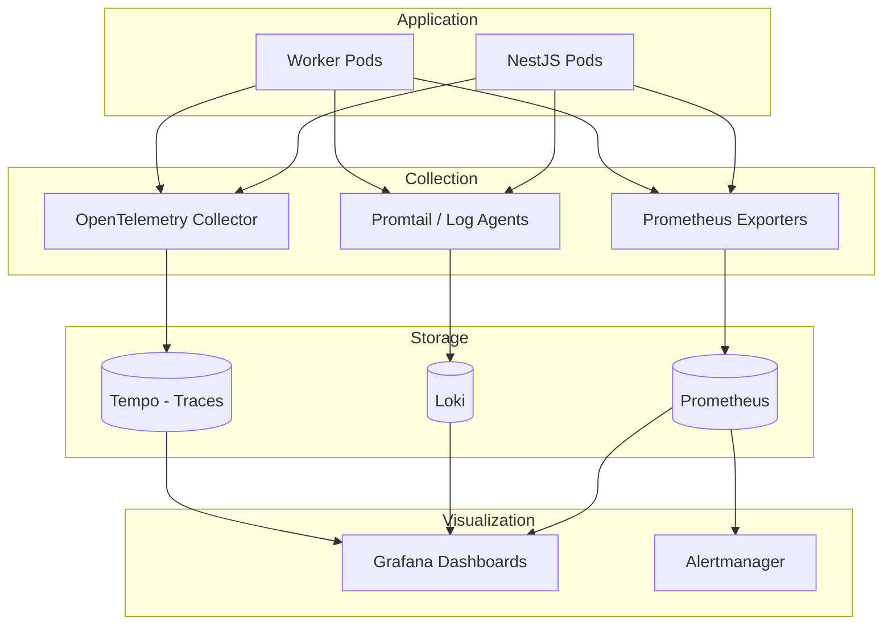

### Logging (Loki)

Structured JSON logs from all NestJS services and workers:

```typescript
// Logging format
{
  "timestamp": "2026-03-15T10:30:00.123Z",
  "level": "info",
  "service": "seo-service",
  "traceId": "abc123def456",
  "spanId": "789ghi",
  "message": "Keyword research completed",
  "brandId": "665a...",
  "jobId": "seo-kr-abc123",
  "duration": 4523,
  "keywordsFound": 87
}
```

**Log collection:** Promtail agents on each Kubernetes node ship container logs to Loki. Labels include `namespace`, `pod`, `container`, and `service`.

### Metrics (Prometheus)

Custom metrics exposed via `/metrics` endpoint on each service:

| Metric | Type | Description |
|---|---|---|
| `http_requests_total` | Counter | Total HTTP requests by method, route, status |
| `http_request_duration_seconds` | Histogram | Request latency distribution |
| `bullmq_jobs_completed_total` | Counter | Completed queue jobs by queue name |
| `bullmq_jobs_failed_total` | Counter | Failed queue jobs by queue name |
| `bullmq_queue_depth` | Gauge | Current jobs waiting per queue |
| `bullmq_job_duration_seconds` | Histogram | Job processing time |
| `gemini_api_calls_total` | Counter | Gemini API calls by model, status |
| `gemini_api_latency_seconds` | Histogram | Gemini response time |
| `gemini_tokens_used_total` | Counter | Token usage by model (input/output) |
| `mongodb_operations_total` | Counter | DB operations by collection, type |
| `vector_search_latency_seconds` | Histogram | Atlas vector search response time |
| `active_agent_tasks` | Gauge | Currently running agent tasks |

### Distributed Tracing (Tempo)

OpenTelemetry SDK instruments:
- HTTP requests (end-to-end from ALB to response)
- BullMQ job execution (enqueue → process → complete)
- Gemini API calls (request → response)
- MongoDB queries (query → result)

Trace IDs propagate across async boundaries (HTTP → Queue → Worker) via BullMQ job metadata.

### Dashboards

| Dashboard | Panels |
|---|---|
| **API Overview** | Request rate, error rate, p50/p95/p99 latency, top endpoints |
| **Queue Health** | Queue depth, processing rate, failure rate, DLQ size |
| **AI Usage** | Gemini calls/min, token usage, cost estimate, error rate |
| **Agent Monitor** | Active tasks, completion rate, avg duration, state distribution |
| **Infrastructure** | CPU, memory, pod count, node health |

### Alerting Rules

| Alert | Condition | Severity |
|---|---|---|
| High error rate | 5xx rate > 5% for 5 min | Critical |
| Queue backlog | Queue depth > 1000 for 10 min | Warning |
| DLQ accumulation | DLQ size > 50 | Warning |
| Gemini API errors | Error rate > 10% for 5 min | Critical |
| High latency | p95 > 5s for 10 min | Warning |
| Pod crash loop | Pod restarts > 3 in 10 min | Critical |
| Disk usage | > 85% on any PV | Warning |

---

## 13. Scaling Strategy

### Horizontal Scaling by Layer

| Component | Scaling Trigger | Strategy |
|---|---|---|
| NestJS API Pods | CPU > 70% or RPS > threshold | Kubernetes HPA (2–20 pods) |
| AI Workers | Queue depth > 100 | KEDA scaler on BullMQ queue length |
| Scraping Workers | Queue depth > 50 | KEDA scaler |
| Content Workers | Queue depth > 50 | KEDA scaler |
| Analytics Workers | Cron-triggered load | Scheduled scaling (scale up before batch windows) |
| MongoDB | Read throughput / storage | Atlas auto-scaling (M30+ tier), read replicas |
| Redis | Memory / connections | ElastiCache cluster mode with read replicas |

### MongoDB Atlas Scaling

- **Vertical:** Auto-scale tier from M30 to M60+ based on CPU/memory
- **Horizontal:** Sharding on `brandId` for `analytics_events` and `ai_prompt_logs` collections (highest write volume)
- **Read replicas:** Secondary reads for analytics queries (using `secondaryPreferred` read preference)
- **Atlas Vector Search:** Scales independently with dedicated search nodes, can handle millions of embeddings

### AI Call Scaling

```
┌─────────────────────────────────────────────────┐
│               Gemini API Strategy               │
├─────────────────────────────────────────────────┤
│  • Rate limit: 60 RPM (free) → 1000+ RPM (paid) │
│  • Queue-based backpressure via BullMQ           │  
│  • Token budget per brand per day                │
│  • Automatic retry with exponential backoff      │
│  • Circuit breaker: stop after 10 consecutive    │
│    failures, retry after 60s                     │
│  • Cost ceiling alerts at 80% of monthly budget  │
└─────────────────────────────────────────────────┘
```

### Queue Scaling

- BullMQ queues auto-scale workers via **KEDA** (Kubernetes-based Event Driven Autoscaler)
- KEDA monitors Redis queue depth and triggers pod scaling
- Worker concurrency is configurable per queue (see Section 6)
- Priority queues ensure critical tasks (auth, compliance) are never starved

### Caching Strategy at Scale

| Layer | Tool | TTL | Hit Rate Target |
|---|---|---|---|
| CDN | CloudFront | 1–24h | >90% for static assets |
| API Response | Redis | 5–60 min | >60% for read endpoints |
| Brand Data | Redis | 15 min | >80% (hot path) |
| Vector Search | Application-level LRU | 10 min | >40% for repeated queries |

---

## 14. Infrastructure

### Kubernetes Architecture (AWS EKS)

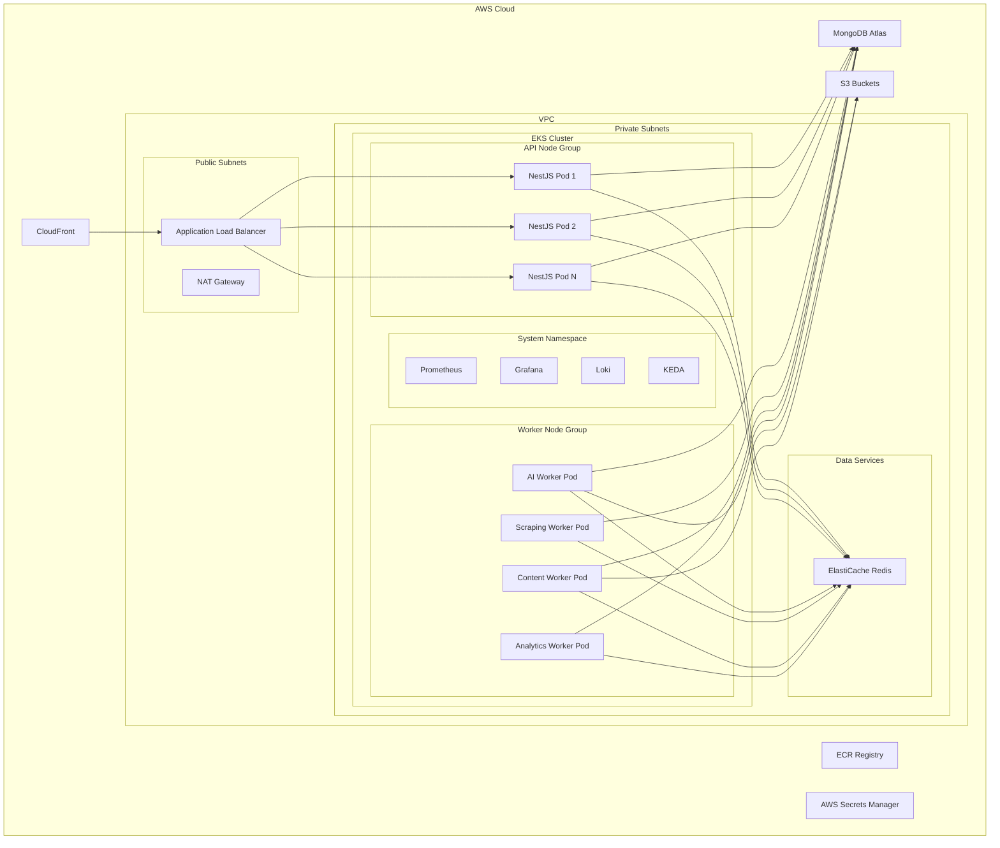

### Kubernetes Resources

```yaml
# API Deployment
apiVersion: apps/v1
kind: Deployment
metadata:
  name: brand-os-api
  namespace: brand-os
spec:
  replicas: 3
  selector:
    matchLabels:
      app: brand-os-api
  template:
    metadata:
      labels:
        app: brand-os-api
    spec:
      containers:
        - name: api
          image: <ECR_REGISTRY>/brand-os-api:latest
          ports:
            - containerPort: 3000
          resources:
            requests:
              cpu: "500m"
              memory: "512Mi"
            limits:
              cpu: "1000m"
              memory: "1Gi"
          env:
            - name: MONGODB_URI
              valueFrom:
                secretKeyRef:
                  name: brand-os-secrets
                  key: mongodb-uri
            - name: REDIS_URL
              valueFrom:
                secretKeyRef:
                  name: brand-os-secrets
                  key: redis-url
          livenessProbe:
            httpGet:
              path: /health
              port: 3000
            initialDelaySeconds: 30
            periodSeconds: 10
          readinessProbe:
            httpGet:
              path: /health/ready
              port: 3000
            initialDelaySeconds: 5
            periodSeconds: 5
---
# HPA for API
apiVersion: autoscaling/v2
kind: HorizontalPodAutoscaler
metadata:
  name: brand-os-api-hpa
  namespace: brand-os
spec:
  scaleTargetRef:
    apiVersion: apps/v1
    kind: Deployment
    name: brand-os-api
  minReplicas: 2
  maxReplicas: 20
  metrics:
    - type: Resource
      resource:
        name: cpu
        target:
          type: Utilization
          averageUtilization: 70
---
# Worker Deployment (AI Workers)
apiVersion: apps/v1
kind: Deployment
metadata:
  name: brand-os-ai-worker
  namespace: brand-os
spec:
  replicas: 2
  selector:
    matchLabels:
      app: brand-os-ai-worker
  template:
    spec:
      containers:
        - name: worker
          image: <ECR_REGISTRY>/brand-os-worker:latest
          command: ["node", "dist/workers/ai-worker.js"]
          resources:
            requests:
              cpu: "500m"
              memory: "1Gi"
            limits:
              cpu: "1000m"
              memory: "2Gi"
```

### CI/CD Pipeline

```
GitHub Push → GitHub Actions
  ├── Lint + Type Check
  ├── Unit Tests
  ├── Integration Tests
  ├── Build Docker Image
  ├── Push to ECR
  ├── Deploy to EKS (Staging)
  ├── Run E2E Tests
  └── Promote to EKS (Production) [manual gate]
```

### Environment Strategy

| Environment | Purpose | Infrastructure |
|---|---|---|
| `development` | Local dev | Docker Compose (MongoDB, Redis) |
| `staging` | Pre-production testing | EKS (1 node, reduced replicas) |
| `production` | Live system | EKS (multi-AZ, auto-scaling) |

### AWS Services Used

| Service | Purpose |
|---|---|
| EKS | Kubernetes cluster |
| ECR | Docker image registry |
| ElastiCache | Managed Redis (cluster mode) |
| S3 | Object storage (content assets, documents) |
| CloudFront | CDN for static assets and API caching |
| ALB | Application load balancer + TLS termination |
| Secrets Manager | Database credentials, API keys |
| Route 53 | DNS management |
| ACM | TLS certificates |
| CloudWatch | Infrastructure-level monitoring (backup) |
| SES | Transactional email (password reset, notifications) |

---

## 15. Phase Implementation Strategy

### Phase 1 — SEO Platform (MVP)

**Duration:** Months 1–4  
**Goal:** Launch a functional SEO analysis and content generation platform.

**Backend deliverables:**
- NestJS project setup with modular architecture
- AuthModule (Better Auth integration)
- BrandModule (CRUD, brand profiling)
- SEOModule (keyword research, competitor analysis, SEO scoring)
- ContentModule (AI content generation via Gemini + LangChain)
- AnalyticsModule (basic event tracking, SEO metrics)
- AgentOrchestratorModule (Brand Profiler, SEO, Content, Competitor, Analytics agents)
- BullMQ queue setup (ai-tasks, scraping, content-generation, seo-pipeline)
- MongoDB schemas (brands, campaigns, seo_keywords, content_assets, analytics_events)
- Redis caching layer
- Docker + Kubernetes (EKS) deployment
- Grafana + Prometheus + Loki observability
- REST APIs for Next.js frontend

**Agents active:** Brand Profiler, Competitor Analysis, SEO, Content, Analytics

---

### Phase 2 — Search Context Optimization (SCO)

**Duration:** Months 5–8  
**Goal:** Add AI search visibility tracking and RAG-powered knowledge retrieval.

**Backend deliverables:**
- SCOModule (prompt tracking, AI answer scraping, visibility scoring)
- RAGModule (document ingestion, embedding, MongoDB Atlas Vector Search)
- MongoDB schemas (ai_prompt_logs, ai_answers, document_chunks)
- Vector search indexes on MongoDB Atlas
- BullMQ queues (sco-pipeline, ingestion)
- LangChain RAG chains with Gemini embeddings
- SCO analytics endpoints
- Enhanced analytics (AI visibility metrics)

**Agents added:** SCO Agent, Prompt Tracking Agent

---

### Phase 3 — Autonomous Marketing OS

**Duration:** Months 9–14  
**Goal:** Full marketing automation with multi-channel publishing, compliance, and RL optimization.

**Backend deliverables:**
- PublishingModule (social, CMS, ad platform connectors)
- IntegrationModule (Shopify, GA4, Search Console connectors)
- Brand Compliance Agent (content validation against brand rules)
- Forecasting Agent (AI-driven campaign performance prediction)
- RL Agent (reinforcement learning for content/prompt optimization)
- BullMQ queues (publishing)
- Enhanced RBAC (team management, multi-brand)
- Webhook system for external integrations
- Advanced analytics (cross-channel attribution, funnel analysis)

**Agents added:** Publishing, Brand Compliance, Forecasting, Reinforcement Learning

---

### Gantt Timeline

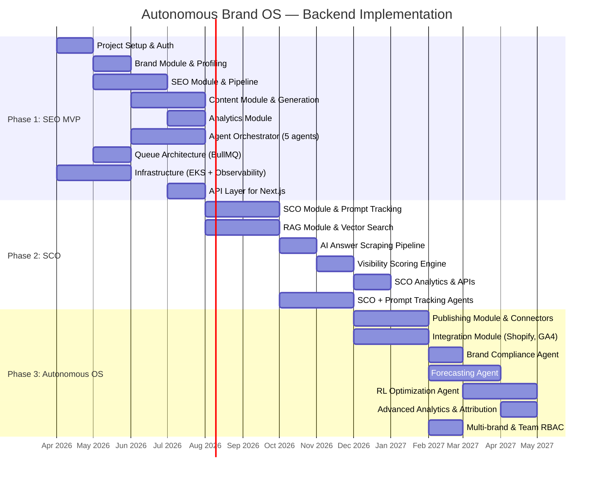

---

## Appendix: Development Environment Setup

### Prerequisites

- Node.js 20+
- Docker Desktop
- kubectl + AWS CLI
- MongoDB Compass (optional)
- Redis Insight (optional)

### Local Development (Docker Compose)

```yaml
# docker-compose.yml
version: '3.9'
services:
  api:
    build: .
    ports:
      - '3000:3000'
    environment:
      - NODE_ENV=development
      - MONGODB_URI=mongodb://mongo:27017/brand-os
      - REDIS_URL=redis://redis:6379
      - GEMINI_API_KEY=${GEMINI_API_KEY}
    depends_on:
      - mongo
      - redis
    volumes:
      - ./src:/app/src

  worker:
    build: .
    command: node dist/workers/main.js
    environment:
      - NODE_ENV=development
      - MONGODB_URI=mongodb://mongo:27017/brand-os
      - REDIS_URL=redis://redis:6379
      - GEMINI_API_KEY=${GEMINI_API_KEY}
    depends_on:
      - mongo
      - redis

  mongo:
    image: mongodb/mongodb-atlas-local:7.0
    ports:
      - '27017:27017'
    volumes:
      - mongo-data:/data/db

  redis:
    image: redis:7-alpine
    ports:
      - '6379:6379'
    volumes:
      - redis-data:/data

volumes:
  mongo-data:
  redis-data:
```

### Environment Variables

```env
# .env.example
NODE_ENV=development
PORT=3000

# MongoDB
MONGODB_URI=mongodb://localhost:27017/brand-os

# Redis
REDIS_URL=redis://localhost:6379

# Google Gemini
GEMINI_API_KEY=your-gemini-api-key

# Better Auth
BETTER_AUTH_SECRET=your-secret-key
BETTER_AUTH_URL=http://localhost:3000

# AWS
AWS_REGION=us-east-1
AWS_S3_BUCKET=brand-os-assets
AWS_ACCESS_KEY_ID=your-access-key
AWS_SECRET_ACCESS_KEY=your-secret-key

# Frontend
FRONTEND_URL=http://localhost:3001
```

---

> **End of Document**  
> This architecture is designed to evolve across three phases without rewrites. Each module, agent, and pipeline is independently deployable and testable. The unified MongoDB strategy (operational data + vector search) minimizes infrastructure overhead while maintaining production-grade performance at scale.
